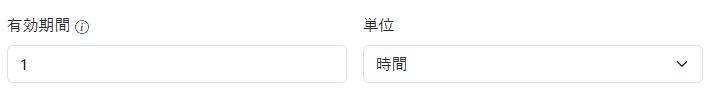
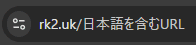
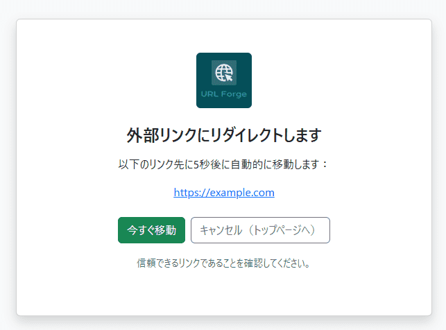
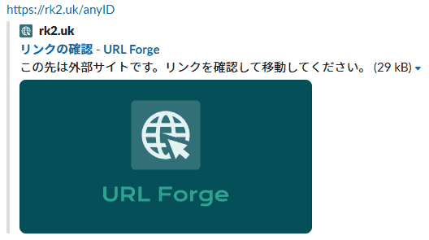
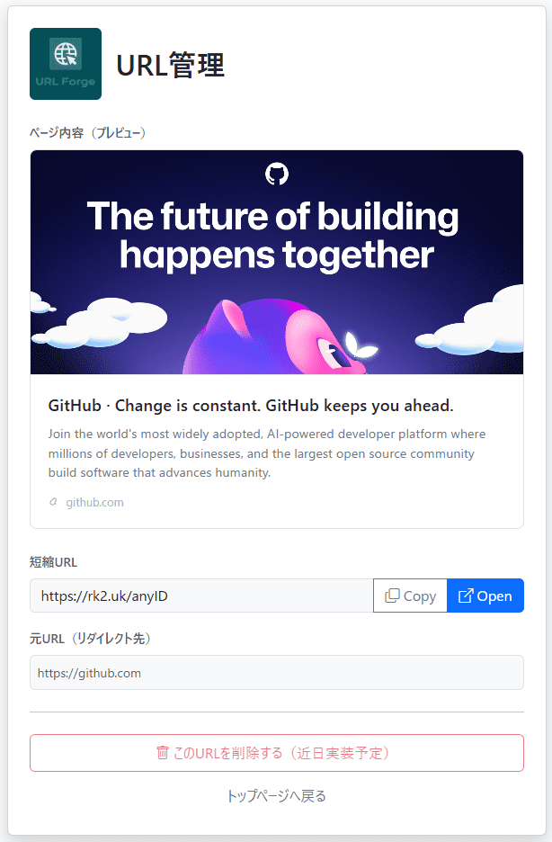

<div align="center">
    <a href="https://rk2.uk">
        
    </a>
    <a href="./LICENSE">
        
    </a>
    
    <a href="https://codecov.io/gh/Outtech105k/ShortUrlServer">
        
    </a>
</div>

## Overview

自分の使いたい形式に合わせて、カスタムURLを作成できます。

ここから利用できます。
[https://rk2.uk](https://rk2.uk)

個々の要望に応じたURLを職人のように生成したい、という想いで **"URL Forge"** と命名しました。

## Features

### 1. 期間限定URLの作成



- URLにアクセスできる有効期限を設定できます。
- 相手からアクセスできる時間を限定したい時に。

### 2. 日本語等を含むカスタムURLを設定可能



- 一般的なURL短縮ツールは使用可能な文字が制限される。
  - アルファベット・数字・ハイフン `-`・アンダーバー `_` のみが一般的
- 日本語や他の外国語、様々な記号もURLに設定できます。

> [!WARNING]
> この機能を使用すると、予期しない動作を引き起こす可能性があります。
> 理解の上、注意して使用してください。
> [参考ページ](/docs/rules.md)

### 3. ネタバレ防止ができるクッションページ





- 指定先URLに飛ばす前に、一時的に表示する「クッションページ」を設定できます。
- 一般的なURL短縮ツールは、SNSなどで共有した際、アクセス先のページ内容が表示されてしまう場合も。
- クッションページが挟まることで、リンク内容を先に見られたくない場合に隠すことができます。
  - 悪意のあるページも隠すことができるため、情報モラルに沿って利用しましょう。

### 4. カスタムURLの操作機能



- 生成したURLに対し、操作ページが作成できます。
- 操作ページには、 `https://rk2.uk/(設定したID)/control` でアクセス可能（設定した場合のみ）。
- 今後は削除機能・アクセス解析等を実装予定。

## Rules & Constraints

URL生成に関するルールや制約については、以下をご確認ください。

[URL生成ルールと制約](/docs/rules.md)

## REST API Usage

URL生成サービスは、REST APIに対応しています。
GUIアプリと機能は同じです。

[POST `/api/set`](/docs/api/POSTset.md): Set Custom URL

## Usage

### Preconfigure

`config.sample.env` を `config.env` にコピーし、環境に合わせて各値を設定してください。

#### 設定項目

| 環境変数 | 説明 | デフォルト値 |
| :--- | :--- | :--- |
| `ENDPOINT` | **(必須)** 公開サーバーのURL (例: `https://example.com`) | - |
| `PORT` | サーバーの待受ポート番号 | `8080` |
| `REDIS_ADDR` | Redisサーバーのアドレス | `redis:6379` |
| `REDIS_PASSWORD` | Redisのパスワード | (空) |
| `REDIS_DB` | RedisのDB番号 | `0` |
| `APP_NAME` | アプリケーション名 (HTMLタイトル等に反映) | `URL Forge` |
| `ALLOW_ORIGINS` | CORS許可オリジン (カンマ区切り、または `*`) | `*` |
| `SHUTDOWN_TIMEOUT` | シャットダウン時の待機時間 | `5s` |
| `OGP_FETCH_TIMEOUT` | OGP取得時のタイムアウト時間 | `5s` |
| `DEFAULT_ID_LENGTH` | 自動生成されるIDのデフォルト長 | `6` |
| `MAX_ID_LENGTH` | IDの最大長 | `100` |
| `MAX_RETRY_COUNT` | ID自動生成時の衝突回避リトライ回数 | `10` |
| `BOT_USER_AGENTS` | ボット判定に使用するUser-Agentのリスト (カンマ区切り) | (主要なボット) |

### Startup

1. 開発環境では

```bash
docker compose -f compose.dev.yml up --build
```

[Air](https://github.com/air-verse/air) を利用してホットリロード開発ができます。(適宜`-d`オプションを付加してください)

2. デプロイ環境では

```bash
docker compose -f compose.prod.yml up -d --build
```

マルチステージングにより、バイナリにビルドした後に [Alpineコンテナ](https://hub.docker.com/_/alpine)で実行されます。

## Thanks

ロゴ作成ツールには [Shopify ロゴメーカー](https://www.shopify.com/jp/tools/logo-maker) を使用しました。
素晴らしいサービスの提供者に感謝申し上げます。

## Contact

Plat (プラット)

<a href="https://github.com/Outtech105k">
    
</a>
<a href="https://x.com/105techno">
    
</a>
<a href="mailto:techno510tk@gmail.com">
    
</a>
